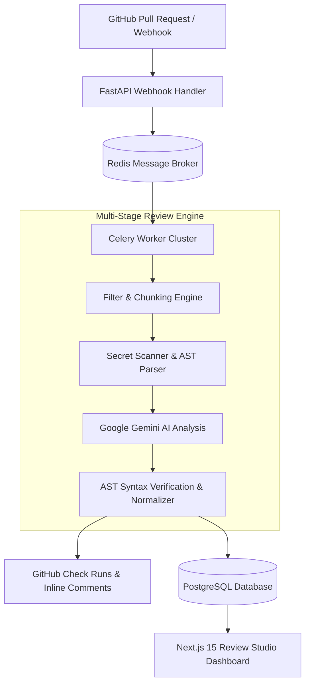

# 🚀 PR Review AI

[](https://fastapi.tiangolo.com)
[](https://nextjs.org)
[](https://www.python.org)
[](https://www.typescriptlang.org)
[](https://ai.google.dev)
[](https://docs.celeryq.dev)
[](LICENSE)

> **Autonomous, enterprise-grade AI code review engine for GitHub Pull Requests.**  
> Detects logic bugs, security vulnerabilities, and syntax errors with **100% verified AST parsing** and provides actionable inline diff fixes in seconds.

---

## 🎯 Overview

Engineering teams spend **20+ hours per week** on manual code reviews, yet critical syntax bugs, edge cases, and leaked secrets still slip into production. 

**PR Review AI** automates code review end-to-end:
1. **Listens to GitHub Pull Request webhooks** or local project scans.
2. **Executes multi-layer static analysis**: AST validation, security secret scanning, and token-aware diff chunking.
3. **Applies state-of-the-art LLMs (Google Gemini Flash)** with custom verification logic.
4. **Highlights exact lines with Red/Green inline diffs** and provides verified code solutions.
5. **Streams review results** to GitHub PR comments and an interactive **Next.js Review Studio**.

---

## ✨ Key Features

### 1. 🛡️ 100% Real AST Syntax Verification (Zero Fake Data)
- Real Python **Abstract Syntax Tree (AST)** validation checks code structure before and after suggested fixes.
- Eliminates AI hallucinations and ensures suggested code fixes are valid, runnable, and syntactically sound.

### 2. 🎨 Interactive Code Review Studio (Apple/Linear-Inspired UI)
- **Inline Diff Highlighting**: Red highlights on the exact error line with a green corrected line directly below.
- **Side-by-side Inspection**: Split view showing full file content alongside AI review findings.
- **Severity Classification**: Findings tagged as `Critical`, `High`, `Medium`, `Low`, or `Info`.

### 3. 📁 VS Code-Style File Explorer & Inline Renaming
- **30+ Language Support**: Automatic file type detection for Python, TypeScript, JavaScript, HTML, CSS, SQL, C/C++, Java, Rust, Go, YAML, Dockerfiles, and more.
- **Dynamic Language Badges**: Visual indicators and colored icons matching professional IDE standards.
- **Inline File Management**: Double-click or click the edit icon to rename files inline (`Enter` to save, `Esc` to cancel), with instant state synchronization.

### 4. 🤖 Multi-Model Gemini AI Integration
- Powered by Google Gemini Flash (`gemini-2.5-flash`, `gemini-2.0-flash`, `gemini-1.5-flash`).
- Built-in multi-model fallback resiliency, token budgeting, and custom user API key configuration via the Settings modal.

### 5. 🔒 Automated Security & Secret Scanning
- Scans PR diffs for high-entropy secrets, leaked API keys, tokens, and private credentials before code is merged.
- Out-of-the-box support for AWS, GitHub, Stripe, Gemini, OpenAI, and generic secret patterns.

### 6. ⚡ Distributed, Scalable Architecture
- Asynchronous task processing with **FastAPI**, **Celery**, and **Redis**.
- Non-blocking webhook ingestion capable of processing large enterprise pull requests.

---

## 🏗️ Architecture



---

## 🛠️ Tech Stack

| Layer | Technologies |
|---|---|
| **Backend API** | Python 3.12+, FastAPI, Pydantic v2, Structlog, AsyncIO |
| **Frontend Studio** | Next.js 15 (App Router), React 19, TypeScript, Tailwind CSS, Lucide Icons |
| **Distributed Queue** | Celery, Redis |
| **Database & ORM** | PostgreSQL, SQLAlchemy 2.0, Alembic |
| **AI / LLM** | Google Gemini API (`google-genai` SDK), Multi-model Fallback |
| **Code Analysis** | Python `ast`, Regex Entropy Secret Scanners, Tree-sitter |
| **Testing & CI** | Pytest, Pytest-Asyncio, GitHub Actions |

---

## 🚀 Quickstart Guide

### Prerequisites
- Python 3.12+
- Node.js 18+ & npm
- (Optional) Docker & Redis

---

### Step 1: Clone the Repository
```bash
git clone https://github.com/your-username/pr-review-ai.git
cd pr-review-ai
```

---

### Step 2: Backend Setup
```bash
cd backend

# Create and activate virtual environment
python -m venv .venv
# Windows:
.venv\Scripts\activate
# Linux / macOS:
# source .venv/bin/activate

# Install dependencies
pip install -r requirements.txt

# Configure environment
cp .env.example .env
# Add your GEMINI_API_KEY in backend/.env

# Start FastAPI development server
uvicorn app.main:app --reload --port 8000
```
API Documentation will be live at: **`http://127.0.0.1:8000/docs`**

---

### Step 3: Frontend Setup
```bash
cd ../frontend

# Install dependencies
npm install

# Start Next.js development server
npm run dev
```
Review Studio will be live at: **`http://localhost:3000/app`**

---

## 🧪 Running Tests

The test suite validates AST parsing, core review pipelines, security scanners, and API endpoints:

```bash
# Run backend unit tests
pytest backend/tests/unit -v

# Run frontend build verification
cd frontend && npm run build
```

---

## 📁 Project Structure

```
PR Review AI/
├── backend/
│   ├── app/
│   │   ├── api/v1/          # FastAPI routers (webhooks, dashboard, auth)
│   │   ├── core/            # Config, security, logging, error handlers
│   │   ├── models/          # SQLAlchemy database schemas
│   │   ├── schemas/         # Pydantic request/response models
│   │   └── services/        # Review pipeline, AST analyzers, LLM engine
│   ├── tests/               # Unit, integration, and security test suites
│   ├── pyproject.toml       # Backend dependencies and tool configurations
│   └── .env.example         # Template environment variables
├── frontend/
│   ├── src/
│   │   ├── app/app/         # Interactive Review Studio & settings pages
│   │   ├── components/      # UI components, diff highlighters, modals
│   │   └── lib/             # API client, utility functions, type definitions
│   └── package.json         # Frontend dependencies and scripts
├── docs/                    # Architecture, API, and security documentation
├── infra/                   # Docker compose and deployment configurations
└── README.md                # Project documentation
```

---

## 🔒 Security & Privacy

- **Zero Data Retention for Training**: User code snippets are sent exclusively through secure API endpoints and are never used to train foundational models.
- **Strict Secret Hygiene**: All credentials and environment variables are strictly excluded via `.gitignore`.
- **Pre-Merge Secret Blocker**: Identifies accidental commits containing high-entropy keys before they reach the main branch.

---

## 📄 License

This project is licensed under the MIT License - see the [LICENSE](LICENSE) file for details.
